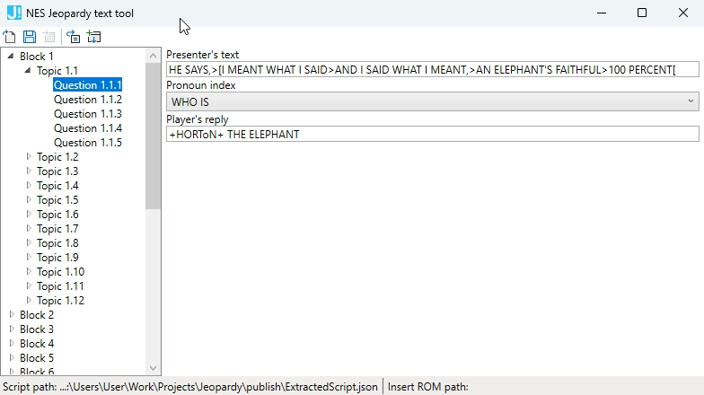

JeopardyNesTextTool
===========

Huffman compression tool and text editor for NES "Jeopardy! 25th Anniversary Edition" game and it's hacks.

Features
-----
- Support for script format of "Jeopardy! 25th Anniversary Edition" and for it's hacks. As example in the release folder there is a separate config for "Jeopardy: Battletoads Edition" hack 
- GUI editor for structured script blocks
- Possible script editing in JSON format
- WPF application with the MVVM design pattern can be used for as base for other script editors development

Usage
-------
First of all, you need to prepare the NES ROM from which you will extract the game script. For example, Jeopardy! 25th Anniversary Edition (U).nes. By clicking on the extract script button, the ExtractedScript.json file will appear in the application folder. It is most convenient to load this file into the program for further editing (using the Open file button). But you can edit in json format, if that’s convenient for you.  
To insert the resulting script into ROM, you need to prepare a copy of the original ROM and point it to the program (using the Set destination ROM button). And then by clicking on the Insert button, the text will be saved and inserted into the specified ROM. You can already test it in the emulator.  
The standard file Config.json is intended for ROM Jeopardy! 25th Anniversary Edition (U).nes, but it is also possible to edit the text of various hacks of this game. For example, for "Jeopardy: Battletoads Edition", there is a ConfigBattletoads.json file in the application folder. If you rename it to Config.json, the program will be able to extract and insert text into this hack.

Licence
-------
For license information please see LICENSE.md 

